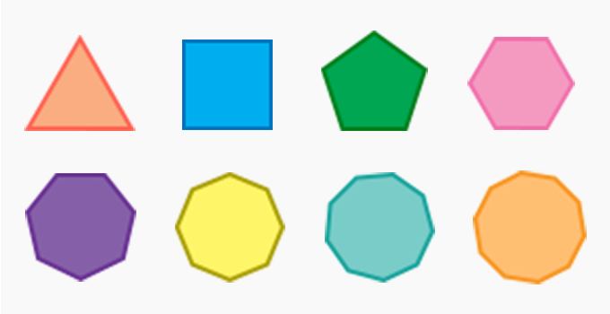
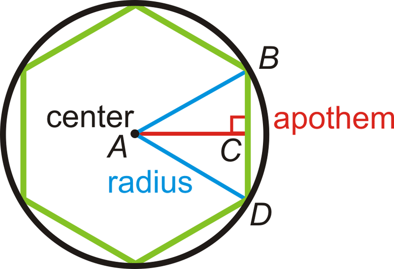

## 1. Objective: Sequence Types I

1. A regular strictly convex polygon is a polygon that has the following characteristics:
    - all interior angles are less than 180
    - all sides have equal length
    - 
2. For a regular strictly convex polygon with:
    - n edges (=n vertices)  
    - R circumradius  
    - 𝑖𝑛𝑡𝑒𝑟𝑖𝑜𝑟𝐴𝑛𝑔𝑙𝑒=(𝑛−2)⋅180𝑛
    - 𝑒𝑑𝑔𝑒𝐿𝑒𝑛𝑔𝑡ℎ,𝑠=2⋅𝑅⋅sin(𝜋𝑛)
    - 𝑎𝑝𝑜𝑡ℎ𝑒𝑚,𝑎=𝑅⋅cos(𝜋𝑛)
    - 𝑎𝑟𝑒𝑎=12⋅𝑛⋅𝑠⋅𝑎
    - 𝑝𝑒𝑟𝑖𝑚𝑒𝑡𝑒𝑟=𝑛⋅𝑠
3. Objective 1 :
    - Create a Polygon Class:
        - where initializer takes in:
            - number of edges/vertices
            - circumradius
        - that can provide these properties:
            - \# edges
            - \# vertices
            - interior angle
            - edge length
            - apothem
            - area
            - perimeter
        - that has these functionalities:
            - a proper __repr__ function
            - implements equality (==) based on # vertices and circumradius (__eq__)
            - implements > based on number of vertices only (__gt__)
4. Objective 2:
    - Implement a Custom Polygon sequence type:
        - where initializer takes in:
            - number of vertices for largest polygon in the sequence
            - common circumradius for all polygons
    - that can provide these properties:
        - max efficiency polygon: returns the Polygon with the highest area: perimeter ratio
    - that has these functionalities:
        - functions as a sequence type (__getitem__)
        - supports the len() function (__len__)
        - has a proper representation (__repr__)
5. Results:
    - Implement these 2 classes as a separate module. Access these modules in a jupyter-notebook (or Google Colab or Deep Note)
    - Run Objective 1 module to show that the functionalities are implemented properly
    - Run Objective 2 module and show which polygon is efficient for n = 25
    - You are submitting link to your GitHub repo, where we can find the 2 modules and your notebook in which you have called and tested them
    - All your code must be publicly accessible (make sure to open all links in an incognito window before submitting)